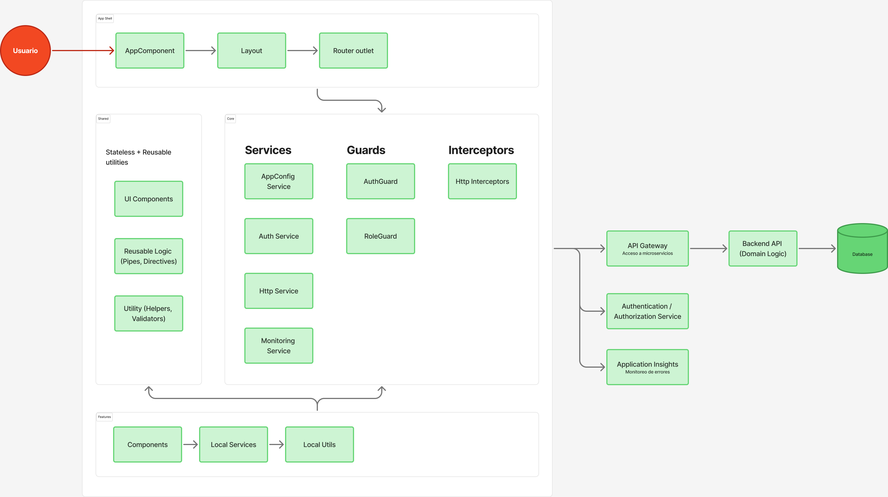
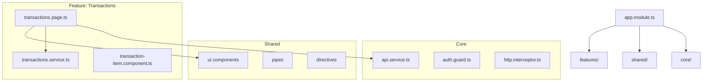

# Introduction

This document describes the project architecture, including its key decisions, main components, internal structures, and C4 diagrams.

The goal is to provide a clear reference for current and future developers, facilitate onboarding, and improve system maintainability.

# Architectural Objectives

- Maintain a modular, scalable, and easy-to-maintain architecture.
- Separate responsibilities into layers (Core, Shared, Features, App Shell) following separation of concerns principles.
- Ensure that communication with APIs and external services is centralized.
- Maintain a consistent design based on documented development rules.
- Allow incorporation of new features without affecting existing ones.
- Follow the [official Angular Style Guide](https://angular.dev/style-guide) to maintain code consistency.
- Use Tailwind CSS for utilities and maintain BEM with `ft-` prefix for component styles.
- Establish clear rules for AI-assisted development that ensure consistent application of architectural decisions.

# Scope

This document describes the frontend architecture, including:

- Angular project structure  
- Internal layers (Core, Shared, Feature Modules)  
- API communication  
- Internal libraries  
- C4 diagrams

# Architecture Overview

The project is based on Angular, structured through functional modules and folders that separate responsibilities.

The architecture follows the C4 Model, which describes the system from highest to lowest level of detail.

# C4 Level 3 – Component Diagram (Frontend)

This diagram shows the main internal components of the system and how they interact with each other.

# C4 Level 4 – Internal Modules and Classes Diagram

This section details the actual internal code structure, useful for developers.

You can show:

- Folder hierarchy  
- Internal components  
- Services  
- Interfaces  
- Inter-module communication  

# Architectural Decisions (ADRs)

Records key decisions:

### ADR-001 — Separation of responsibilities: Core, Shared, and Features

**Status:** accepted
**Reason:** maintain a modular, scalable, and easy-to-maintain architecture with clear separation of responsibilities.

**Structure:**
- **Core:** global services, guards, interceptors, global models, shared utilities
- **Shared:** reusable UI components, pipes, directives, common validators
- **Features:** domain-specific functionalities (e.g., `auth/`, `samples/`)

**Rules:**
- Each feature is independent and can contain its own components, services, models, repositories, and managers
- Features should not depend on each other directly
- Features can use Core and Shared, but not the other way around
- Each feature defines its own routes in a `*-routes.ts` file

**Reference:** See detailed structure in `.cursor/rules/project-structure.mdc`

### ADR-002 — Adoption of the official Angular Style Guide

**Status:** accepted
**Reason:** maintain code consistency, facilitate onboarding, and follow best practices recommended by the Angular team.

**Reference:** [Angular Style Guide](https://angular.dev/style-guide)

**Key aspects applied:**
- **File naming:** use hyphens to separate words (e.g., `user-profile.ts`)
- **Class naming:** use PascalCase for classes (e.g., `UserProfile`)
- **Project structure:** organize by features, not by file type
- **Dependency injection:** prefer `inject()` over constructor injection
- **Components:** use `input()`, `output()`, `computed()` instead of decorators
- **Templates:** use native control flow (`@if`, `@for`, `@switch`) instead of structural directives
- **Bindings:** prefer `class` and `style` bindings over `ngClass` and `ngStyle`
- **Selectors:** use consistent application prefix for components and directives
- **One concept per file:** keep files focused on a single responsibility

**Impact:** All Angular Style Guide rules are documented in `.cursor/rules/` to be automatically applied by AI tools.

### ADR-003 — Use of Tailwind CSS for utility classes and component creation

**Status:** accepted
**Reason:** improves development speed, eliminates dead CSS, maintains consistency, and reduces maintenance.  
**Impact:** All layout, spacing, and typography utilities must use Tailwind CSS classes. Custom classes with `ft-` prefix are reserved solely for component-specific styles following BEM.

### ADR-004 — AI-assisted development rules (Cursor)

**Status:** accepted
**Reason:** standardize AI-assisted development to maintain consistency, quality, and follow the project's architectural decisions.

**Implementation:**
- All architectural decisions and style rules are documented in `.cursor/rules/`
- Rules include: project structure, CSS styles (Tailwind + BEM), form validation, icon usage, REST services, testing, and more
- Rules are automatically applied when using Cursor for AI-assisted development

**Benefits:**
- Automatic consistency in generated code
- Faster onboarding for new developers
- Reduction of errors and style deviations
- Living and executable documentation

# Security and Privacy

- Data sanitization  
- JWT authentication (if applicable)  
- Route guards  
- Mandatory HTTPS  

# Performance and Optimization

- Module lazy loading  
- OnPush change detection  
- Service caching  

# Conclusions

This document establishes the base structure and dependencies of the project, serving as a guide to maintain code coherence and facilitate system scaling.
