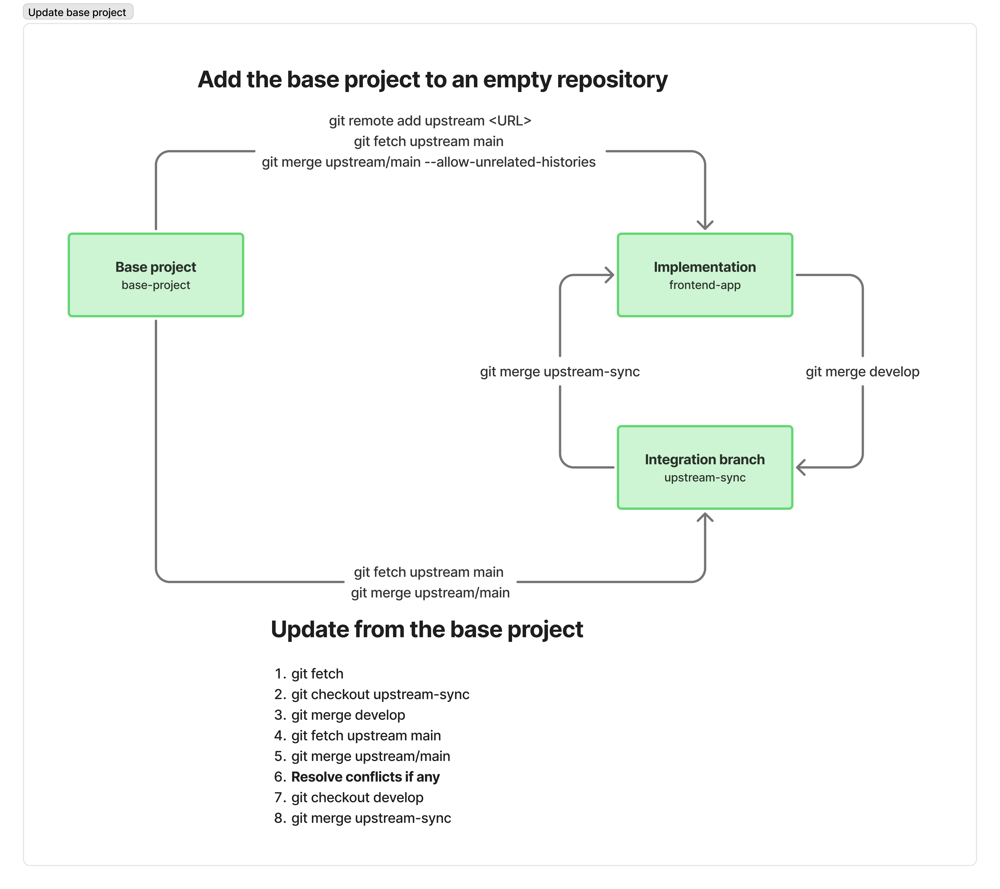

# Comenzando con Angular Base Project

Este documento explica cómo usar el Angular Base Project como punto de partida para crear nuevos proyectos.

## Resumen

El Angular Base Project es un **boilerplate** diseñado para servir como base para nuevas aplicaciones Angular. Incluye:

- Arquitectura preconfigurada
- Herramientas de desarrollo y estándares de calidad
- Mejores prácticas y convenciones
- Documentación y ADRs
- Componentes y servicios listos para usar
- Listo para trabajar con agentes de IA

## Instalación

**Nota:** Este repositorio es un boilerplate. Se recomienda crear tu propio repositorio vacío y sincronizarlo con el repositorio principal.

### Repositorio Principal

**Repositorio:** `angular-base-project`

### Crear tu Nuevo Repositorio de Proyecto

#### Paso 1: Crear tu Repositorio Vacío

```bash
git init angular-app
cd angular-app
```

#### Paso 2: Agregar el Repositorio Principal como Upstream

```bash
git remote add upstream <URL proyecto base>
git fetch upstream main
git merge upstream/main --allow-unrelated-histories
```

### Estructura de Repositorios

Al configurar tu proyecto, tendrás dos remotes:

- **`origin`** → Tu copia/fork (el repositorio sobre el que tienes permisos de escritura)
- **`upstream`** → El repositorio base del que proviene este proyecto

### Agregar el proyecto base a un repositorio vacío

Si partes de un repositorio de implementación vacío (*angular-app*), configura el proyecto base como remoto *upstream* e intégralo así:

```bash
git remote add upstream <URL del proyecto base>
git fetch upstream main
git merge upstream/main --allow-unrelated-histories
```

Para proyectos que usan una **rama de integración** (`upstream-sync`), esa rama se mantiene sincronizada con el proyecto base y se integra con tu rama de desarrollo (`develop`) mediante fusiones en ambos sentidos.

### Actualizar desde el proyecto base

Cuando tu proyecto ya está creado a partir del base y quieres traer los últimos cambios del proyecto base, sigue esta ruta usando la rama de integración `upstream-sync`:



1. **Traer referencias remotas**
   ```bash
   git fetch main
   ```

2. **Cambiar a la rama de integración**
   ```bash
   git checkout upstream-sync
   ```

3. **Integrar tu rama de desarrollo en la rama de integración**
   ```bash
   git merge develop
   ```

4. **Traer los últimos cambios del proyecto base**
   ```bash
   git fetch upstream main
   ```

5. **Fusionar el proyecto base en la rama de integración**
   ```bash
   git merge upstream/main
   ```

6. **Resolver conflictos si los hay**  
   Revisa los archivos en conflicto, resuelve manteniendo tus personalizaciones donde corresponda y completa la fusión.

7. **Volver a tu rama de desarrollo**
   ```bash
   git checkout develop
   ```

8. **Integrar la rama de integración en desarrollo**
   ```bash
   git merge upstream-sync
   ```

Con esto, tu rama `develop` queda actualizada con los cambios del proyecto base.

### Sincronizar sin rama de integración

Si no usas la rama `upstream-sync` y trabajas directamente sobre `main` (o tu rama principal):

```bash
git fetch upstream main
git checkout main
git merge upstream/main
```

**No se recomienda** este flujo: al fusionar directamente en tu rama principal, los conflictos son más difíciles de aislar y se aumenta el riesgo de perder cambios o de resolver mal los conflictos. Es preferible usar la rama de integración `upstream-sync` como se describe arriba.

### Manejo de Conflictos

Si ocurren conflictos durante la fusión:

1. Revisa los conflictos cuidadosamente
2. Resuelve los conflictos preservando tus personalizaciones
3. Prueba exhaustivamente después de resolver conflictos
4. Confirma la fusión

## Configuración Inicial

Después de clonar o fusionar el proyecto base, sigue estos pasos:

### 1. Instalar Dependencias

```bash
npm install
```

### 2. Configurar Ajustes del Proyecto

Actualiza los siguientes archivos con información específica de tu proyecto:

- **`package.json`**: Actualiza el nombre del proyecto, descripción y URL del repositorio
- **`angular.json`**: Actualiza el nombre del proyecto si es necesario
- **`README.md`**: Actualiza con información específica de tu proyecto
- **Archivos de entorno**: Configura variables de entorno en `src/environments/`

### 3. Actualizar Metadatos del Proyecto

- Actualiza `public/manifest.webmanifest` con los detalles de tu app
- Actualiza `public/index.html` con el título de tu app y meta tags

### Mejores Prácticas

- **Mantén las personalizaciones separadas**: Evita modificar archivos de arquitectura core a menos que sea necesario
- **Documenta tus cambios**: Actualiza los ADRs si haces cambios arquitectónicos significativos
- **Prueba después de actualizaciones**: Siempre prueba tu aplicación después de fusionar cambios del upstream
- **Revisa los cambios**: Revisa los cambios del upstream antes de fusionar para entender qué hay de nuevo

## Referencias

- [Documentación de Arquitectura](./README.md)
- [Registros de Decisiones Arquitectónicas (ADRs)](./adr/README.md)
- [Documentación de Angular](https://angular.dev)
- [README del Proyecto](../README.md)
