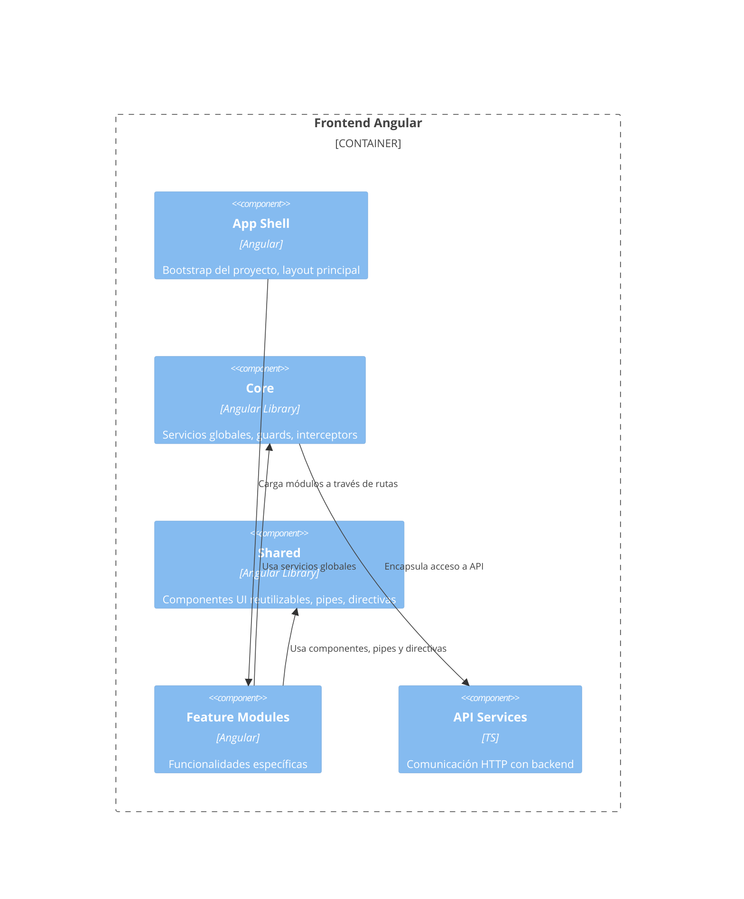
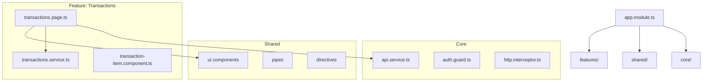

# 1. Introducción

Este documento describe la arquitectura del proyecto, incluyendo sus decisiones clave, componentes principales, estructuras internas y diagramas C4.

El objetivo es proporcionar una referencia clara para desarrolladores actuales y futuros, facilitar el onboarding y mejorar la mantenibilidad del sistema.

# 2. Objetivos Arquitectónicos

- Mantener una arquitectura modular, escalable y fácil de mantener.
- Separar responsabilidades en capas (Core, Shared, Features, App Shell).
- Asegurar que la comunicación con APIs y servicios externos esté centralizada.
- Mantener un diseño consistente basado en reglas de desarollo.
- Permitir incorporación de nuevas funcionalidades sin afectar las existentes.

# 3. Alcance

Este documento describe la arquitectura del frontend, incluyendo:

- Estructura del proyecto Angular  
- Capas internas (Core, Shared, Feature Modules)  
- Comunicación con APIs  
- Librerías internas  
- Diagramas C4

# 4. Visión General de la Arquitectura

El proyecto está basado en Angular, estructurado mediante módulos funcionales y carpetas que separan responsabilidades.

La arquitectura sigue el C4 Model, que describe el sistema desde mayor a menor nivel de detalle.

# 5. C4 Level 3 – Diagrama de Componentes (Frontend)

Este diagrama muestra los principales componentes internos del sistema y cómo interactúan entre sí.

Inserta aquí tu diagrama (Mermaid o PlantUML).

Ejemplo (Mermaid):



# 6. C4 Level 4 – Diagrama Interno de Módulos y Clases

Aquí se detalla la estructura interna real del código, útil para desarrolladores.

Puedes mostrar:

- Jerarquía de carpetas  
- Componentes internos  
- Servicios  
- Interfaces  
- Comunicación entre módulos  

Ejemplo (Mermaid):



# 7. Estructura de Carpetas

```
src/
 ├── app/
 │    ├── core/
 │    ├── shared/
 │    ├── features/
 │    ├── app.component.*
 │    └── app.routes.ts
 ├── assets/
 └── environments/
```

# 8. Decisiones Arquitectónicas (ADRs)

Registra decisiones clave:

### ADR-001 — Uso de Tailwind en lugar de SCSS tradicional

**Estado:** aceptada  
**Motivo:** mejora velocidad de desarrollo, elimina CSS muerto y mantiene consistencia.

### ADR-002 — Dividir Core y Shared

**Core:** servicios globales  
**Shared:** componentes reusables

# 9. Seguridad y Privacidad

- Sanitización de datos  
- Autenticación JWT (si aplica)  
- Guards de ruta  
- HTTPS obligatorio  

# 10. Performance y Optimización

- Lazy Loading de módulos  
- OnPush Change Detection  
- Caché en servicios  

# 11. Versionamiento

Describe cómo guardar versiones:

```
docs/
  architecture/
     v1/
     v2/
```

# 12. Conclusiones

Este documento establece la estructura base y las dependencias del proyecto, sirviendo como guía para mantener la coherencia del código y facilitar escalar el sistema.
