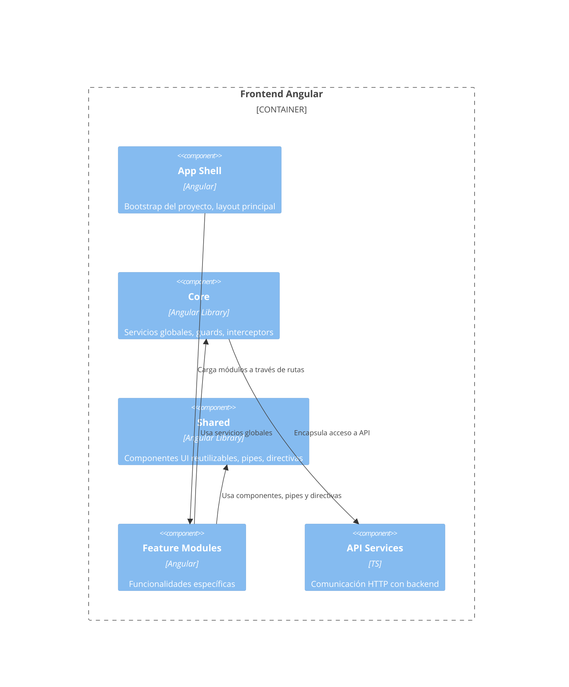
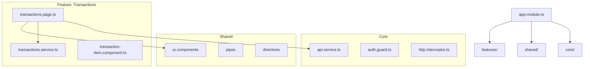

# Introducción

Este documento describe la arquitectura del proyecto, incluyendo sus decisiones clave, componentes principales, estructuras internas y diagramas C4.

El objetivo es proporcionar una referencia clara para desarrolladores actuales y futuros, facilitar el onboarding y mejorar la mantenibilidad del sistema.

# Objetivos Arquitectónicos

- Mantener una arquitectura modular, escalable y fácil de mantener.
- Separar responsabilidades en capas (Core, Shared, Features, App Shell) siguiendo principios de separación de concerns.
- Asegurar que la comunicación con APIs y servicios externos esté centralizada.
- Mantener un diseño consistente basado en reglas de desarrollo documentadas.
- Permitir incorporación de nuevas funcionalidades sin afectar las existentes.
- Seguir el [Angular Style Guide oficial](https://angular.dev/style-guide) para mantener consistencia en el código.
- Utilizar Tailwind CSS para utilidades y mantener BEM con prefijo `ft-` para estilos de componentes.
- Establecer reglas claras para desarrollo asistido por IA que garanticen la aplicación consistente de las decisiones arquitectónicas.

# Alcance

Este documento describe la arquitectura del frontend, incluyendo:

- Estructura del proyecto Angular  
- Capas internas (Core, Shared, Feature Modules)  
- Comunicación con APIs  
- Librerías internas  
- Diagramas C4

# Visión General de la Arquitectura

El proyecto está basado en Angular, estructurado mediante módulos funcionales y carpetas que separan responsabilidades.

La arquitectura sigue el C4 Model, que describe el sistema desde mayor a menor nivel de detalle.

# 5. C4 Level 3 – Diagrama de Componentes (Frontend)

Este diagrama muestra los principales componentes internos del sistema y cómo interactúan entre sí.

# C4 Level 4 – Diagrama Interno de Módulos y Clases

Aquí se detalla la estructura interna real del código, útil para desarrolladores.

Puedes mostrar:

- Jerarquía de carpetas  
- Componentes internos  
- Servicios  
- Interfaces  
- Comunicación entre módulos  

# Decisiones Arquitectónicas (ADRs)

Registra decisiones clave:

### ADR-001 — Uso de Tailwind CSS en lugar de clases utilitarias propias

**Estado:** aceptada  
**Fecha:** 2025  
**Motivo:** mejora velocidad de desarrollo, elimina CSS muerto, mantiene consistencia y reduce mantenimiento.  
**Impacto:** Todas las utilidades de layout, spacing y tipografía deben usar clases de Tailwind CSS. Las clases personalizadas con prefijo `ft-` se reservan únicamente para estilos específicos de componentes siguiendo BEM.

### ADR-002 — Separación de responsabilidades: Core, Shared y Features

**Estado:** aceptada  
**Fecha:** 2025  
**Motivo:** mantener una arquitectura modular, escalable y fácil de mantener con separación clara de responsabilidades.

**Estructura:**
- **Core:** servicios globales, guards, interceptors, modelos globales, utilidades compartidas
- **Shared:** componentes UI reutilizables, pipes, directivas, validadores comunes
- **Features:** funcionalidades específicas del dominio (ej: `auth/`, `samples/`)

**Reglas:**
- Cada feature es independiente y puede contener sus propios componentes, servicios, modelos, repositorios y managers
- Las features no deben depender entre sí directamente
- Las features pueden usar Core y Shared, pero no al revés
- Cada feature define sus propias rutas en un archivo `*-routes.ts`

**Referencia:** Ver estructura detallada en `.cursor/rules/project-structure.mdc`

### ADR-003 — Adopción del Angular Style Guide oficial

**Estado:** aceptada  
**Fecha:** 2025  
**Motivo:** mantener consistencia en el código, facilitar el onboarding y seguir las mejores prácticas recomendadas por el equipo de Angular.

**Referencia:** [Angular Style Guide](https://angular.dev/style-guide)

**Aspectos clave aplicados:**
- **Nomenclatura de archivos:** usar guiones para separar palabras (ej: `user-profile.ts`)
- **Nomenclatura de clases:** usar PascalCase para clases (ej: `UserProfile`)
- **Estructura de proyecto:** organizar por features, no por tipo de archivo
- **Inyección de dependencias:** preferir `inject()` sobre inyección por constructor
- **Componentes:** usar `input()`, `output()`, `computed()` en lugar de decoradores
- **Templates:** usar control flow nativo (`@if`, `@for`, `@switch`) en lugar de directivas estructurales
- **Bindings:** preferir `class` y `style` bindings sobre `ngClass` y `ngStyle`
- **Selectores:** usar prefijo de aplicación consistente para componentes y directivas
- **Un concepto por archivo:** mantener archivos enfocados en una sola responsabilidad

**Impacto:** Todas las reglas del Angular Style Guide están documentadas en `.cursor/rules/` para ser aplicadas automáticamente por herramientas de IA.

### ADR-004 — Reglas de desarrollo asistido por IA (Cursor)

**Estado:** aceptada  
**Fecha:** 2025  
**Motivo:** estandarizar el desarrollo asistido por IA para mantener consistencia, calidad y seguir las decisiones arquitectónicas del proyecto.

**Implementación:**
- Todas las decisiones arquitectónicas y reglas de estilo están documentadas en `.cursor/rules/`
- Las reglas incluyen: estructura de proyecto, estilos CSS (Tailwind + BEM), validación de formularios, uso de iconos, servicios REST, testing, y más
- Las reglas se aplican automáticamente cuando se usa Cursor para desarrollo asistido por IA

**Reglas disponibles:**
- `project-structure.mdc` - Estructura de carpetas y organización
- `css-styling.mdc` - Guías de estilos (Tailwind + BEM)
- `form-field-validation.mdc` - Validación de formularios reactivos
- `icons.mdc` - Uso de iconos con `<ft-icon />`
- `rest-services.mdc` - Patrones para servicios REST
- `unit-testing.mdc` - Estrategias de testing
- `cursor.mdc` - Mejores prácticas de Angular y TypeScript
- Y más...

**Beneficios:**
- Consistencia automática en el código generado
- Onboarding más rápido para nuevos desarrolladores
- Reducción de errores y desviaciones del estilo
- Documentación viva y ejecutable

# Seguridad y Privacidad

- Sanitización de datos  
- Autenticación JWT (si aplica)  
- Guards de ruta  
- HTTPS obligatorio  

# Performance y Optimización

- Lazy Loading de módulos  
- OnPush Change Detection  
- Caché en servicios  

# Conclusiones

Este documento establece la estructura base y las dependencias del proyecto, sirviendo como guía para mantener la coherencia del código y facilitar escalar el sistema.
