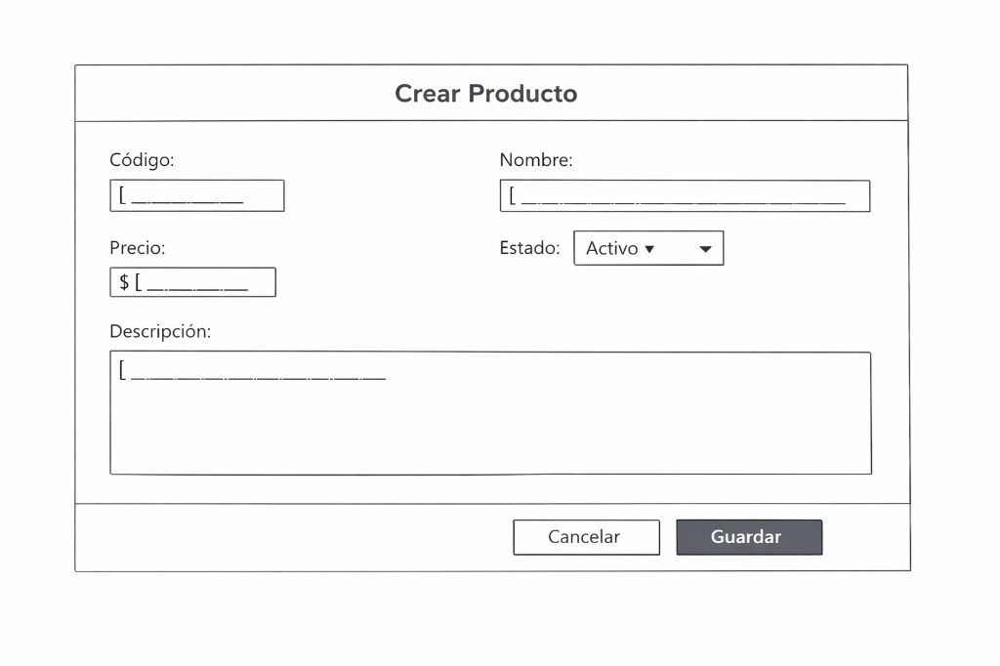
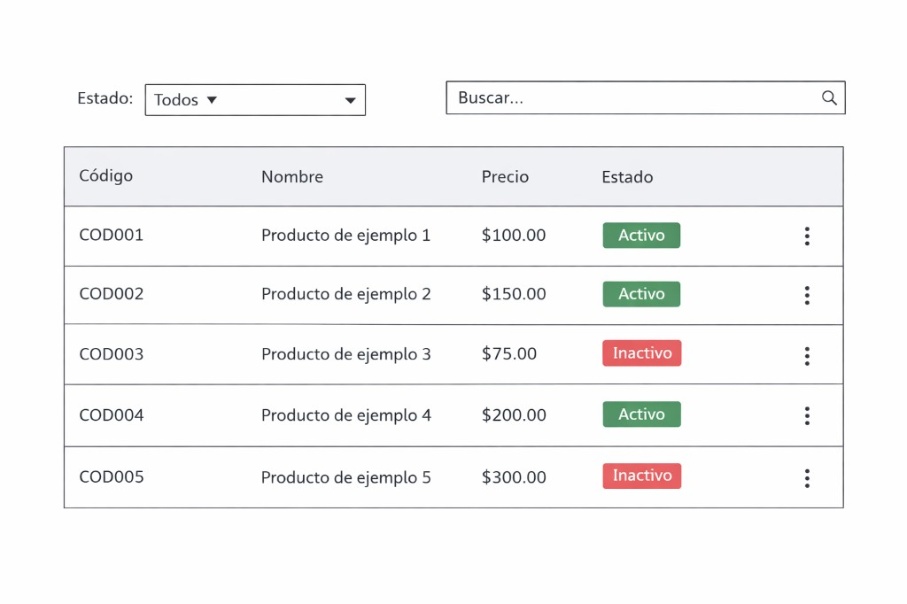

- **ID:** US-001
- **Nombre corto:** Gestión de productos (catálogo)
- **Estado:** Ready
- **Prioridad:** Media

## Descripción

**Como** administrador de productos  
**Quiero** crear, ver, editar, **ver el detalle al seleccionar un producto en el listado**, **archivar**, **actualizar el estado** de un producto **archivado** a **activo** o **inactivo** (mismo tipo de **update** de `status` que en otras transiciones permitidas), o **eliminar** productos con **SKU**, nombre, descripción, precio, moneda de operación (`currency`), estado operativo, y **filtrar el listado por estado** cuando consulte el catálogo  
**Para** mantener el catálogo correcto, evitar duplicados, recuperar productos archivados en el estado operativo que corresponda, enfocarme en los productos relevantes en cada contexto, retirar productos del uso operativo cuando haga falta (archivo) o borrarlos definitivamente solo cuando corresponda (eliminación)

## Características

- **Alta:** dar de alta un producto con **SKU** ([glosario](../../glossary.md)), nombre, descripción (opcional), precio, campo **`currency`** (moneda en que se opera el producto) y **estado** inicial. El **estado por defecto** en la alta es siempre **`active`**. El **`currency` por defecto** es **`USD`** y **no puede modificarse** (ni en alta ni en edición; ver reglas). Referencia visual del flujo de alta: [Diálogo de creación de producto](#diálogo-de-creación-de-producto) (wireframe en `assets/wireframe-dialogo-crear-producto.png`).
- **Listado, filtro y detalle:** ver los productos con información principal (**SKU**, nombre, precio, **`currency`**, estado; descripción y demás campos en la **vista de detalle** al **seleccionar la fila o el registro**). El listado incluye un **filtro de estado** cuyas **etiquetas en pantalla** están en **español**: **Todos**, **Activo**, **Inactivo** y **Archivado** (mapeadas internamente a `active`, `inactive` y `archived`). Al elegir un estado concreto, solo se muestran productos en ese estado. **Todos** muestra productos **activos e inactivos** y **excluye** los **archivados**; los archivados **solo** aparecen con el filtro **Archivado**. Con el filtro **Archivado**, el administrador puede **cambiar el estado** de cada producto a **activo** o **inactivo** (**actualización de estado**, misma naturaleza que el resto de transiciones permitidas), **mediante el menú contextual u otra acción por fila** definida en planificación. Referencia visual del listado: [Listado de productos](#listado-de-productos) (wireframe en `assets/wireframe-listado-productos.png`).
- **Edición:** modificar **SKU**, nombre, descripción, precio y **transiciones de estado** entre **`active`** e **`inactive`** mientras el producto **no** esté en **`archived`**. El campo **`currency`** **no** es editable: se mantiene fijo (**`USD`** en el alcance actual).
- **Archivar:** acción **distinta** de la eliminación y del **cambio de estado desde archivado**; pasa el producto a estado **`archived`**. **No requiere confirmación** ni diálogo previo; el cambio de estado se aplica de forma inmediata.
- **Cambio de estado desde `archived`:** es un **update** de **`status`** a **`active`** o **`inactive`** (no hay acción de negocio ni endpoint distintos). Disponible **solo** en el contexto del listado filtrado por **`archived`** (el administrador debe poder elegir **uno u otro** destino). **No requiere confirmación** ni diálogo previo. La forma en pantalla, atajos y contratos se concretan en la **planificación de tareas**.
- **Eliminar:** acción **distinta** del archivo; **borra el producto de forma definitiva** en el sistema (hard delete). Está permitida **para cualquier producto**, **independientemente de su estado** (`active`, `inactive` o `archived`). **Siempre** exige **confirmación explícita**; el texto del diálogo debe incluir el **nombre del producto** y seguir la redacción obligatoria indicada en **Reglas de negocio**.

## Tareas

Orden sugerido de implementación:

1. [TK-001 — Modelos, repositorio, manager, rutas y documentación técnica](./TK-001-modelos-repositorio-manager-rutas-documentacion.md)
2. [TK-003 — Listado, filtrado y detalle al seleccionar registro](./TK-003-vista-listado-filtro-detalle.md)
3. [TK-002 — Diálogos crear y editar producto](./TK-002-dialogo-crear-editar-producto.md)
4. [TK-004 — Menú contextual y acciones por fila](./TK-004-menu-contextual-producto.md)

**Nota (dependencias):** [TK-003](./TK-003-vista-listado-filtro-detalle.md) solo depende de TK-001. [TK-002](./TK-002-dialogo-crear-editar-producto.md) y [TK-004](./TK-004-menu-contextual-producto.md) integran sobre la shell de listado/detalle de TK-003. Opcionalmente, **TK-002** puede iniciarse en paralelo a TK-003 si solo se construye el diálogo aislado; la conexión con listado, detalle y botón de alta exige **TK-003** cerrada o en curso con los puntos de entrada acordados en esa tarea. [TK-004](./TK-004-menu-contextual-producto.md) depende explícitamente de TK-003.

Las tareas **TK-001–TK-004** pertenecen solo a la unidad **angular-base-project** y deben cumplir [Unidades de trabajo](../../work-units.md): sin mezclar alcance con **symfony-base-project** (API, persistencia, normalización, unicidad de negocio en servidor). Ese trabajo implica tareas y repositorio propios del backend, no listadas aquí.

Referencia técnica consolidada (contrato compartido, no solo frontend): [catalogo-productos.md](../../technical-docs/catalogo-productos.md). [Glosario de producto](../../glossary.md) (p. ej. **SKU**).

## Referencias de interfaz (wireframes)

Referencias visuales orientativas para alinear maquetación con producto; la implementación en **angular-base-project** debe cumplir las **reglas de negocio** de esta historia en lo aplicable al cliente (p. ej. **`currency`** fijo **USD**, **SKU** según [glosario](../../glossary.md), precio a 2 decimales). La normalización y unicidad «en servidor» las implementará **symfony-base-project** ([Unidades de trabajo](../../work-units.md)), no las tareas **TK** de esta carpeta.

### Diálogo de creación de producto



Incluye título **Crear Producto**, campos **SKU**, **Nombre**, **Precio** (p. ej. con prefijo **$**), **Estado** (desplegable, p. ej. **Activo** por defecto), **Descripción** (área de texto) y botones **Cancelar** / **Guardar**. El wireframe **no** muestra el campo **`currency`**; en desarrollo debe incorporarse como valor **no editable** (**USD**), p. ej. junto a precio o estado, según diseño final.

### Listado de productos



Incluye filtro **Estado** con etiqueta en español (p. ej. **Todos**), campo **Buscar…**, tabla con columnas **SKU**, **Nombre**, **Precio** (formato con **$** y dos decimales), **Estado** (indicadores **Activo** / **Inactivo**; aplicar también **Archivado** cuando corresponda), **selección de fila o registro para abrir el detalle** del producto y menú de acciones por fila (archivar, eliminar, cambio de estado a activo o inactivo cuando el filtro es Archivado, según contexto).

## Reglas de negocio

> **Nota:** el detalle técnico de **backend** (normalizaciones de unicidad, contratos de API, códigos de error frente a servidor real) está en [catalogo-productos.md](../../technical-docs/catalogo-productos.md) **como referencia de contrato**, no como trabajo de las tareas frontend **TK-001–TK-004**. Aquí solo se fijan acuerdos de producto que condicionan el alcance.

- El **nombre del producto** es obligatorio, con **longitud máxima de 60 caracteres**, y debe ser **único** en el catálogo a nivel de dominio. Para la **unicidad**, el **backend** compara nombres tras **normalización** con estas reglas:
  - **Insensible a mayúsculas y minúsculas** (no distingue caso).
  - **Sin considerar acentos** (p. ej. equivalencias entre letras con tilde y sin tilde según la lógica acordada en implementación).
  - **Espacios al inicio y al final:** no se consideran (se descartan).
  - **Espacios entre palabras:** solo se considera **uno**; secuencias de varios espacios consecutivos cuentan como **un único** espacio entre palabras.
- El **SKU** ([glosario](../../glossary.md)) es obligatorio y debe ser **único** en el catálogo a nivel de dominio. La **validación definitiva de unicidad** del SKU la realiza el **backend** (reglas de normalización del identificador, si las hubiera, en contrato API). En el **frontend** (tareas TK actuales) solo se reflejan errores del servidor cuando exista integración; **no** se duplica la lógica de dominio.
- La **descripción** es **opcional**.
- **`currency`:** atributo que indica la **moneda en que se opera** el producto. Valor por defecto **`USD`**. **No puede modificarse** en interfaz ni en flujos de edición (en el alcance actual todo producto opera en USD de forma fija).
- El **precio** es obligatorio, numérico y no negativo, interpretado en la moneda del **`currency`** del producto (**`USD`** por defecto). El **redondeo y la presentación** usan **hasta 2 dígitos decimales** (almacenamiento, cálculos y visualización acordes a esta precisión salvo detalle técnico en tareas).
- **Estado** (`estado`): cada producto está en uno de:
  - **`active`:** disponible para uso operativo según las reglas del catálogo. En **alta**, el valor por defecto es **`active`**.
  - **`inactive`:** no disponible para uso operativo, pero distinto de archivado (p. ej. pausa temporal).
  - **`archived`:** producto **archivado** mediante la acción **Archivar**; permanece en el sistema con ese estado; no debe tratarse como activo ni como inactivo “operativo”.
- **Filtro “Todos” vs archivados:** con el filtro **Todos**, el listado **no** debe incluir productos **archivados**. Para verlos, el administrador elige el filtro **Archivado**.
- **Salida de `archived`:** las acciones que **actualizan `status`** desde **`archived`** hacia **`active`** o **`inactive`** aplican a productos listados **únicamente** cuando el filtro de estado es **`archived`**. **No** llevan confirmación. Hasta que el producto siga **`archived`**, no aplica el flujo habitual de edición que alterna solo **active** ↔ **inactive** (salvo lo que se acuerde en tareas para detalle u otras pantallas).
- **Archivar vs eliminar:** son **dos acciones diferentes**. **Archivar** → pasa a **`archived`** y **no** lleva confirmación. **Eliminar** → **borrado definitivo**; aplica en **cualquier estado**. **Siempre** debe mostrarse **confirmación** con este texto, sustituyendo **[Nombre del producto]** por el **nombre real del producto** (misma redacción y signos): _¿Desea eliminar [Nombre del producto] definitivamente? Esta acción no se puede recuperar._ Sin confirmación no se ejecuta la eliminación.
- Tras crear o editar, el administrador debe ver **feedback claro** de éxito o error (validación de formulario en cliente, y cuando haya API: conflictos/errores devueltos por el **backend**).

## Criterios de Aceptación

Formato **Given / When / Then** (obligatorio para considerarse "Ready").

```gherkin
Feature: Gestión de productos

  Scenario: Crear un producto válido
    Given que soy administrador de productos
    When completo SKU, nombre, precio y descripción opcional, y guardo sin cambiar el estado por defecto ni el currency
    Then el producto queda registrado en estado active, con currency USD, y aparece en el listado con SKU, nombre, precio, currency y estado

  Scenario: Unicidad de nombre y SKU validada en backend
    Given que ya existe un producto con un nombre o SKU determinado y el backend aplica la regla de unicidad
    When intento crear o editar otro producto reutilizando ese nombre o ese SKU
    Then la operación no se completa y el usuario recibe indicación clara del conflicto según el contrato acordado en planificación de tareas

  Scenario: Unicidad de nombre con normalización
    Given que ya existe un producto con nombre almacenado que normalizado equivale a "Café Rojo"
    When intento crear otro producto con un nombre que tras las reglas de normalización coincide (p. ej. distinto solo en mayúsculas, acentos, espacios alrededor o varios espacios entre palabras)
    Then el backend rechaza la duplicidad y el usuario recibe indicación de conflicto de nombre

  Scenario: Longitud máxima del nombre
    Given que estoy en el formulario de alta o edición de producto
    When ingreso un nombre con más de 60 caracteres e intento guardar
    Then el sistema no acepta el valor o no persiste según las validaciones definidas en planificación de tareas y muestra retroalimentación clara

  Scenario: Validación al crear o editar
    Given que estoy en el formulario de alta o edición de producto
    When intento guardar sin SKU, sin nombre, con precio inválido (vacío o negativo) o sin estado válido
    Then el sistema no persiste los cambios y muestra mensajes de validación claros

  Scenario: Editar producto y cambiar entre activo e inactivo
    Given que existe un producto en estado active o inactive
    When modifico datos permitidos o cambio entre active e inactive y guardo
    Then los cambios se reflejan en el listado o detalle según corresponda

  Scenario: Currency no es editable
    Given que estoy en alta o edición de producto
    When intento cambiar el campo currency
    Then el sistema no permite modificarlo y permanece USD

  Scenario: Archivar un producto sin confirmación
    Given que soy administrador de productos y existe un producto que no está archivado
    When elijo la acción de archivar (distinta de eliminar)
    Then el producto pasa a estado archived sin mostrar diálogo de confirmación

  Scenario: Eliminar producto en cualquier estado con texto de confirmación obligatorio
    Given que existe un producto llamado "Aceite 1L" en cualquier estado (active, inactive o archived)
    When elijo la acción de eliminar (borrado definitivo)
    Then el sistema exige confirmación y el mensaje es exactamente: ¿Desea eliminar Aceite 1L definitivamente? Esta acción no se puede recuperar

  Scenario: Confirmar eliminación definitiva
    Given que estoy ante el diálogo de confirmación de eliminación con el texto obligatorio visible
    When confirmo la eliminación
    Then el producto se borra definitivamente y ya no figura en el catálogo

  Scenario: Cancelar eliminación
    Given que estoy ante el diálogo de confirmación de eliminación
    When cancelo la acción
    Then el producto permanece sin cambios en el catálogo

  Scenario: Listado con filtro Todos excluye archivados
    Given que existen productos en estado active, inactive y archived
    When selecciono el filtro de etiqueta Todos
    Then el listado muestra solo productos active e inactive y no muestra ninguno archived

  Scenario: Listado filtrado por un estado operativo
    Given que existen productos en varios estados
    When selecciono el filtro Activo o el filtro Inactivo
    Then el listado muestra únicamente productos en ese estado

  Scenario: Listado filtrado por Archivado muestra solo archivados
    Given que existen productos archived y otros en active o inactive
    When selecciono el filtro Archivado
    Then el listado muestra únicamente productos en estado archived

  Scenario: Seleccionar un producto en el listado abre su detalle
    Given que estoy en el listado del catálogo y existe un producto visible
    When selecciono ese producto en la fila o registro
    Then se muestra el detalle del producto correspondiente con la información acordada

  Scenario: Precio con dos decimales
    Given que creo o edito un producto con un precio que requiere redondeo
    When guardo o muestro el precio en el catálogo
    Then el valor se acota a la precisión de hasta 2 dígitos decimales

  Scenario: Restaurar desde archived a active sin confirmación
    Given que el filtro de estado es archived y hay un producto en estado archived
    When elijo llevar ese producto a active
    Then el producto queda en estado active y ya no está archived sin haberse mostrado un diálogo de confirmación

  Scenario: Restaurar desde archived a inactive sin confirmación
    Given que el filtro de estado es archived y hay un producto en estado archived
    When elijo llevar ese producto a inactive
    Then el producto queda en estado inactive y ya no está archived sin haberse mostrado un diálogo de confirmación
```

## Validación INVEST

La historia debe alinearse con el modelo **INVEST**. Marcar cada criterio solo si se cumple; si alguno no aplica o está en riesgo, documentarlo en observaciones.

- [x] **I — Independiente:** el valor (ABM con estados, filtro de listado, archivo y eliminación definitiva) es acotado; la primera entrega puede apoyarse en **mocks** sin backend (ver Observaciones).
- [x] **N — Negociable:** maquetación de la elección activo/inactivo al actualizar estado desde archivado y matices de contrato API se refinan en planificación de tareas.
- [x] **V — Valiosa:** control del ciclo de vida del producto en catálogo sin duplicados ambiguos.
- [x] **E — Estimable:** las reglas de listado/filtro y unicidad están acotadas; la capa de datos inicial es **mock**, lo que acota incertidumbre hasta migrar a API real.
- [x] **S — Pequeña:** un solo agregado con atributos y estados acotados.
- [x] **T — Testeable:** escenarios cubren unicidad y normalización **en sistema con backend**; en la entrega **solo frontend** (TK actuales) aplican longitud de nombre, validaciones de formulario, precio a 2 decimales, **`currency`** fijo USD, estados, archivo, salida de **`archived`** sin confirmación, eliminación con texto obligatorio y filtros en español (Todos vs Archivado).

## Complejidad (Fibonacci)

Usar la escala típica de story points: **1, 2, 3, 5, 8, 13** (solo Fibonacci en ese conjunto).

- **Story points propuestos:** 5
- **Justificación breve:** CRUD con **SKU**, estados, **`currency`** fijo, filtro, archivo, salida de **`archived`** (**active** o **inactive**) sin confirmación y eliminación definitiva con copy fija; primera iteración **frontend** con **mock**; unicidad y normalización de dominio quedan en **backend** (fuera de las TK actuales); puede subir a 8 al integrar API real.

## Definition of Ready

Criterios para considerar la historia lista para entrar a planificación / desarrollo. Marcar cuando se cumplan:

- [x] Descripción **Como / Quiero / Para** clara y sin ambigüedad mayor
- [x] Criterios de aceptación en **Given / When / Then** redactados
- [x] Reglas de negocio y alcance revisados con producto (etiquetas de filtro en español, precio a 2 decimales; contratos API y mocks en planificación de tareas; ver nota al inicio de Reglas de negocio)
- [x] **INVEST** revisado; **sin bloqueos críticos de dependencias** identificados para el alcance descrito (ver Observaciones)
- [x] Dependencias externas identificadas: primera entrega con **mocks** en cliente; **backend/API** posterior (contratos en `TK-XXX` / `technical-docs`); **diseño** alineable a patrones del proyecto; **sin otra US** declarada como prerrequisito
- [x] **Estimación Fibonacci** propuesta y registrada arriba
- [x] Prioridad y valor de negocio coherentes con el backlog (**Prioridad:** Media; backlog y orden los confirma el equipo en planificación)

## Observaciones

- **Implementación (alcance actual — unidad de trabajo frontend):** la primera entrega usa **mocks** en cliente para flujos de UI, filtrado y estados. La **normalización de nombre**, la **unicidad** de dominio y los **contratos** definitivos del **backend** **no** forman parte de las tareas **TK-001–TK-004**; cuando exista API, el cliente solo debe **consumir** y **mostrar** errores según contrato (`technical-docs/`, trabajo backend).
- **Bloqueos:** no hay **bloqueos críticos de dependencias** declarados para ejecutar esta historia con mocks según el alcance acordado.
- **Normalización para unicidad del nombre:** las reglas de producto están en **Reglas de negocio** para el **backend**. La implementación corresponde al **servidor**; **`technical-docs`** describe el contrato esperado. **No** es alcance de las tareas frontend **TK-001–TK-004**.
- **Documentación técnica:** [catalogo-productos.md](../../technical-docs/catalogo-productos.md); alinear la parte **mock/UI** con el frontend; las secciones **backend** sirven de referencia futura, no de criterio de las TK actuales.
- **Decisiones pendientes (refinamiento):** futura evolución multi-moneda si **`currency`** dejara de ser fijo (fuera de alcance actual); reglas de normalización del **SKU** si se exigen más allá de igualdad literal (no definido en esta US).
- **Referencias de arquitectura** del repo (orientativas para implementación, no alcance funcional): [ADR-006 Repository pattern](../../../adr/ADR-006-repository-pattern.md), [ADR-007 Manager pattern](../../../adr/ADR-007-manager-pattern.md), [ADR-010 Form layout structure](../../../adr/ADR-010-form-layout-structure.md).
