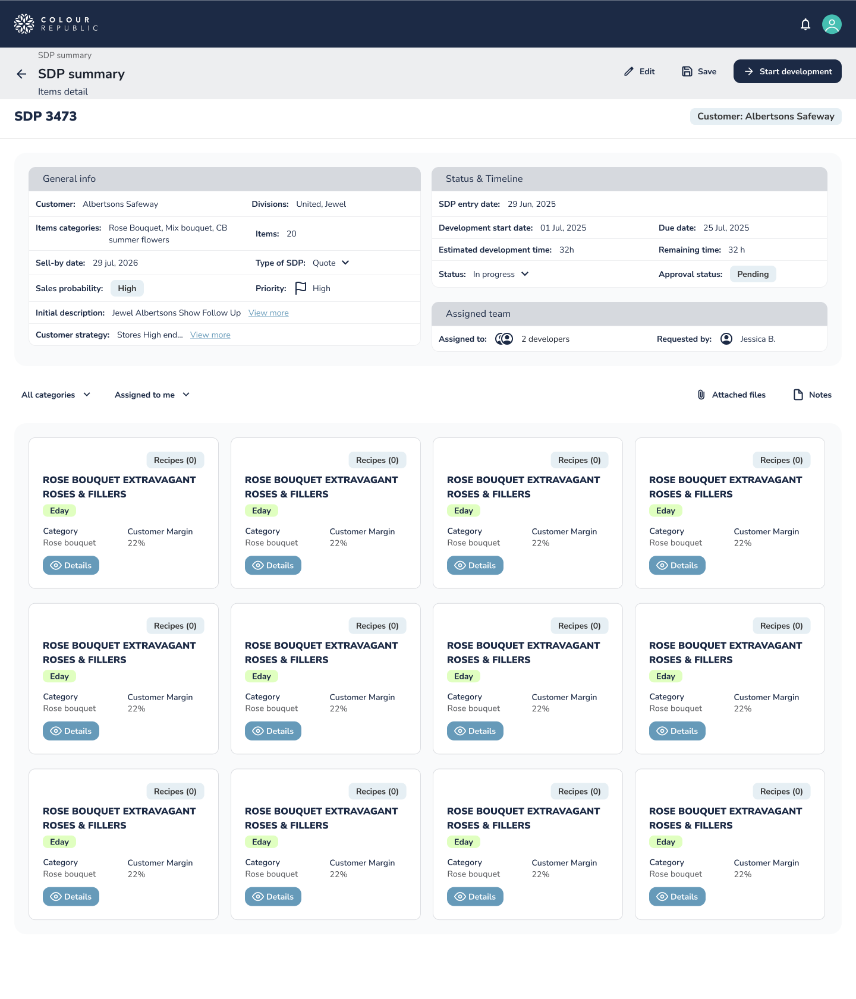
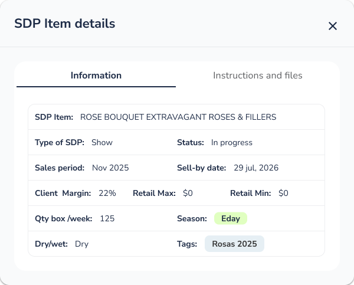
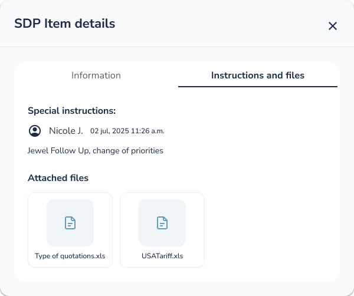
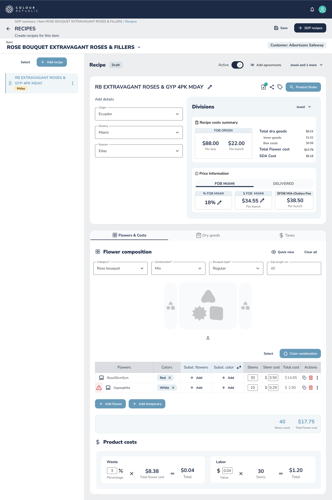
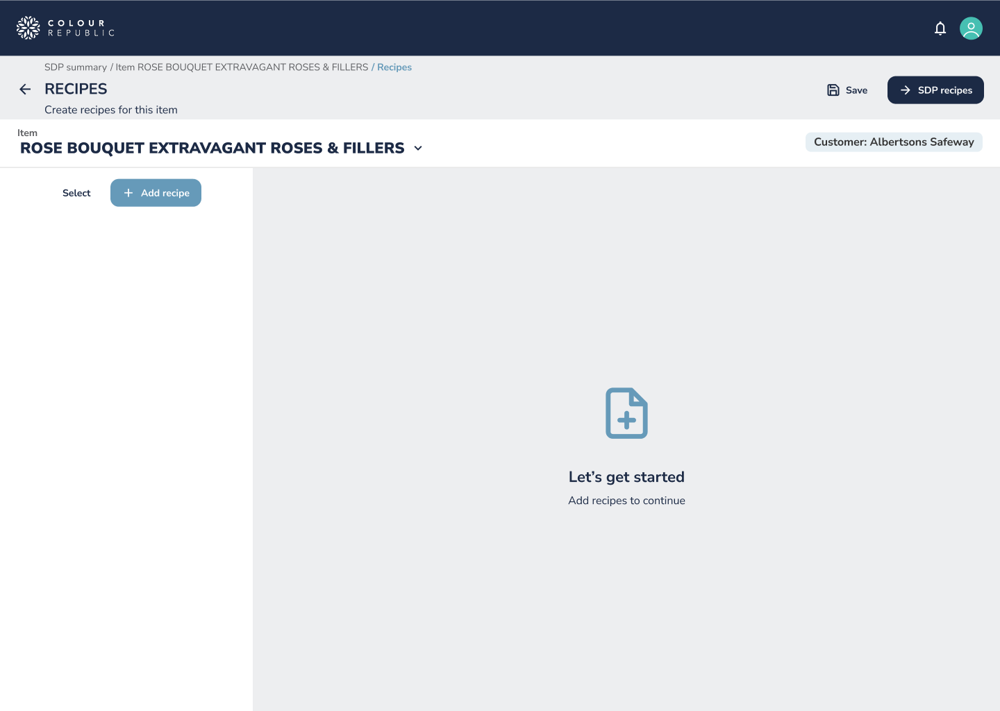

# Feature Specification: Administrador de Requirements

**Feature Branch**: `001-requirements`  
**Created**: 2026-01-05  
**Status**: Draft  
**Input**: User description: "feature del archivo @docs/specs/features/FEAT-001-sdp-manager.md"  
**Location**: `docs/specs/001-sdp-manager/spec.md` (per project constitution)

**Note**: Este feature utiliza los DTOs definidos en `docs/contracts/requirements/`:
- RequirementDTO (representa un Requirement/SDP)
- RequirementItemDTO (representa un ítem de un Requirement)
- RecipeDTO (representa una receta)

**Architecture Compliance**: Esta feature DEBE cumplir con la Constitución del Proyecto Angular Base y los ADRs relevantes en `docs/adr/`.

## Clarifications

### Session 2026-01-06

- Q: ¿Cómo se filtran los RequirementItems por categoría? → A: Los RequirementItems están clasificados por categorías usando un combo de "all categories". El método para obtener RequirementItems debe recibir como parámetros el id del Requirement (obligatorio) y el id de la categoría si se ha especificado una, o null si no se especifica categoría.
- Q: ¿Cómo se muestra el detalle de un RequirementItem? → A: El botón "detail" de un RequirementItem debe abrir un diálogo modal que muestra los detalles del RequirementItem y sus Recipes asociadas. La imagen de referencia está en `docs/specs/001-sdp-manager/assets/requirement-detail.png`.
- Q: ¿Dónde está la referencia visual para el botón de notes? → A: La referencia visual para el botón de notes está en `docs/specs/001-sdp-manager/assets/note-popup.png`.
- Q: ¿Cuáles son las referencias visuales para los RequirementItems según su estado? → A: La referencia visual de un RequirementItem es `docs/specs/001-sdp-manager/assets/requirement-item-recipe.png` cuando tiene recipes, o `docs/specs/001-sdp-manager/assets/requirement-item-empty.png` cuando no tiene recipes.
- Q: ¿Cómo se manejan las peticiones HTTP en la implementación? → A: De momento no hay APIs reales, por tanto se deben usar mocks para todas las peticiones HTTP. Todos los repositories deben utilizar MockHttpClient en lugar de HttpClient real.

## User Scenarios & Testing *(mandatory)*

### User Story 1 - Listar y Visualizar Requirements (Priority: P1)

Los usuarios necesitan ver una lista de todas las Requirements disponibles y poder seleccionar una para ver sus detalles. Esta es la funcionalidad base que permite acceder a la información de las Requirements.

**Why this priority**: Sin la capacidad de listar y visualizar Requirements, los usuarios no pueden acceder a la información necesaria para administrar la producción. Esta es la funcionalidad fundamental que habilita todas las demás capacidades.

**Independent Test**: Puede probarse independientemente verificando que cuando existen Requirements en el sistema, el usuario puede acceder a la lista y seleccionar una Requirement para ver su información básica de identificación y sus RequirementItems asociados.

**Acceptance Scenarios**:

1. **Given** que existen Requirements registradas en el sistema, **When** el usuario accede al administrador de Requirements, **Then** se muestra una lista de todas las Requirements con información básica de identificación
2. **Given** una lista de Requirements visible, **When** el usuario selecciona una Requirement, **Then** se muestran los detalles completos de la Requirement y todos los RequirementItems que la componen
3. **Given** una Requirement seleccionada con RequirementItems de múltiples categorías, **When** el usuario selecciona una categoría del combo "all categories", **Then** se muestran solo los RequirementItems que pertenecen a esa categoría
4. **Given** una Requirement seleccionada con RequirementItems filtrados por categoría, **When** el usuario selecciona "all categories" o limpia el filtro, **Then** se muestran todos los RequirementItems de la Requirement sin filtrar
5. **Given** que no existen Requirements registradas, **When** el usuario accede al administrador de Requirements, **Then** se muestra un mensaje indicando que no hay Requirements disponibles

---

### User Story 2 - Visualizar Recipes de un RequirementItem (Priority: P2)

Los usuarios necesitan ver las Recipes asociadas a cada RequirementItem de una Requirement para entender qué Recipes están configuradas para la producción.

**Why this priority**: Una vez que los usuarios pueden ver los RequirementItems de una Requirement, necesitan ver las Recipes asociadas para entender la configuración completa. Esta información es esencial para la preparación de la producción.

**Independent Test**: Puede probarse independientemente verificando que cuando un usuario hace clic en el botón "detail" de un RequirementItem, se abre un diálogo modal que muestra todas las Recipes asociadas a ese RequirementItem.

**Acceptance Scenarios**:

1. **Given** un RequirementItem de una Requirement visible, **When** el usuario hace clic en el botón "detail" del RequirementItem, **Then** se abre un diálogo modal que muestra los detalles del RequirementItem y todas las Recipes asociadas
2. **Given** un RequirementItem sin Recipes asociadas, **When** el usuario hace clic en el botón "detail" del RequirementItem, **Then** se abre un diálogo modal que muestra los detalles del RequirementItem y un mensaje indicando que no hay Recipes asignadas
3. **Given** un diálogo de detalle de RequirementItem abierto, **When** el usuario hace clic en el botón de cerrar o fuera del diálogo, **Then** el diálogo se cierra y el usuario regresa a la vista de detalles de la Requirement

---

### User Story 3 - Gestionar Recipes de un RequirementItem (Priority: P3)

Los usuarios necesitan poder agregar y eliminar Recipes de los RequirementItems de una Requirement para configurar correctamente las Recipes requeridas para la producción.

**Why this priority**: La capacidad de gestionar Recipes permite a los usuarios configurar y ajustar las Recipes necesarias para cada RequirementItem, completando el ciclo de administración de Requirements.

**Independent Test**: Puede probarse independientemente verificando que cuando un usuario agrega una Recipe a un RequirementItem, la Recipe aparece en la lista de Recipes del RequirementItem, y cuando elimina una Recipe, esta desaparece de la lista.

**Acceptance Scenarios**:

1. **Given** un RequirementItem de una Requirement visible, **When** el usuario agrega una Recipe al RequirementItem, **Then** la Recipe pasa a formar parte del RequirementItem y se muestra en la lista de Recipes asociadas
2. **Given** un RequirementItem con Recipes asociadas, **When** el usuario elimina una Recipe del RequirementItem, **Then** la Recipe deja de aparecer en la lista de Recipes del RequirementItem
3. **Given** un RequirementItem con Recipes asociadas, **When** el usuario intenta agregar una Recipe duplicada, **Then** el sistema previene la duplicación o muestra un mensaje apropiado

---

### Edge Cases

Los siguientes edge cases DEBEN ser manejados y validados durante la implementación:

- **EC-001**: ¿Qué sucede cuando una Requirement tiene un número muy grande de RequirementItems (más de 100)? → El sistema DEBE manejar esto sin degradación del rendimiento (validado por SC-007). Las métricas específicas de validación son: tiempo de renderizado inicial ≤3s, tiempo de respuesta a interacciones ≤500ms, y tasa de frames ≥30 FPS durante scroll.
- **EC-002**: ¿Cómo maneja el sistema cuando un RequirementItem tiene un número muy grande de Recipes asociadas? → El sistema DEBE manejar esto sin degradación del rendimiento (validado por SC-008). Las métricas específicas de validación son: tiempo de renderizado del diálogo ≤2s, tiempo de respuesta a interacciones ≤500ms, y tasa de frames ≥30 FPS durante interacción con la lista.
- **EC-003**: ¿Qué ocurre si el usuario intenta eliminar la última Recipe de un RequirementItem? → El sistema DEBE permitir eliminar la última Recipe y mostrar el estado vacío apropiado
- **EC-004**: ¿Cómo se maneja la situación cuando no hay conexión a la red o el servicio no está disponible? → El sistema DEBE mostrar mensajes de error apropiados y permitir reintento
- **EC-005**: ¿Qué sucede si múltiples usuarios intentan modificar las Recipes del mismo RequirementItem simultáneamente? → El sistema DEBE manejar conflictos de manera apropiada (validación mediante tests E2E)

## Requirements *(mandatory)*

### Functional Requirements

- **FR-001**: El sistema DEBE permitir a los usuarios ver una lista de todas las Requirements disponibles con información básica de identificación para cada Requirement
- **FR-002**: El sistema DEBE permitir a los usuarios seleccionar una Requirement de la lista para ver sus detalles completos
- **FR-003**: El sistema DEBE mostrar todos los RequirementItems que componen una Requirement seleccionada al visualizar los detalles de la Requirement
- **FR-003.1**: El sistema DEBE permitir filtrar los RequirementItems por categoría usando un combo de selección "all categories", mostrando todos los RequirementItems cuando no se especifica una categoría o se selecciona "all categories"
- **FR-003.2**: El sistema DEBE mostrar visualmente diferentes estados de RequirementItems: RequirementItems con Recipes asociadas deben mostrar un estado visual distinto a aquellos sin Recipes
- **FR-004**: El sistema DEBE permitir a los usuarios ver el detalle de un RequirementItem específico dentro de una Requirement mediante un botón "detail"
- **FR-004.1**: El sistema DEBE abrir un diálogo modal cuando el usuario hace clic en el botón "detail" de un RequirementItem
- **FR-005**: El sistema DEBE mostrar todas las Recipes asociadas a un RequirementItem en el diálogo de detalles del RequirementItem
- **FR-005.1**: El sistema DEBE proporcionar un botón "notes" en el diálogo de detalles del RequirementItem. Este botón está presente como placeholder para funcionalidad futura. La gestión completa de notas (crear, editar, eliminar y visualizar) será especificada e implementada en una feature posterior dedicada a la gestión de notas.
- **FR-006**: El sistema DEBE permitir a los usuarios agregar una Recipe a un RequirementItem
- **FR-007**: El sistema DEBE permitir a los usuarios eliminar una Recipe de un RequirementItem
- **FR-008**: El sistema DEBE prevenir que se agreguen Recipes duplicadas al mismo RequirementItem
- **FR-009**: El sistema DEBE mostrar mensajes apropiados cuando no hay Requirements, RequirementItems o Recipes disponibles

### Key Entities *(include if feature involves data)*

- **Requirement**: Representa un Requirement (Solicitud de Desarrollo de Producto) que contiene uno o más RequirementItems. Definido en `docs/contracts/requirements/requirement.md`.

- **RequirementItem**: Representa un RequirementItem individual dentro de un Requirement. Cada RequirementItem puede tener una o más Recipes asociadas que definen cómo se debe producir ese RequirementItem. Definido en `docs/contracts/requirements/requirement-item.md`.

- **Recipe**: Representa una Recipe asociada a un RequirementItem. Las Recipes definen los requisitos o instrucciones necesarias para la producción de un RequirementItem específico. Definido en `docs/contracts/requirements/recipe.md`.

## Success Criteria *(mandatory)*

### Measurable Outcomes

- **SC-001**: Los usuarios pueden acceder y ver la lista de todas las Requirements en menos de 3 segundos desde la carga de la página
- **SC-002**: Los usuarios pueden ver los detalles de una Requirement y los RequirementItems asociados en menos de 2 segundos después de la selección
- **SC-003**: Los usuarios pueden ver los detalles de un RequirementItem y las Recipes asociadas en menos de 2 segundos después de la selección
- **SC-004**: Los usuarios pueden agregar exitosamente una Recipe a un RequirementItem en menos de 5 segundos desde la iniciación hasta la confirmación
- **SC-005**: Los usuarios pueden eliminar exitosamente una Recipe de un RequirementItem en menos de 3 segundos desde la iniciación hasta la confirmación
- **SC-006**: El 95% de los usuarios puede completar el flujo principal (listar Requirement → ver detalles → ver RequirementItem → ver Recipes) en su primer intento sin asistencia. Este criterio se validará mediante tests de usabilidad con usuarios reales o mediante análisis de métricas de interacción (tiempo en tarea, número de clics, tasa de éxito) en tests E2E automatizados.
- **SC-007**: El sistema maneja la visualización de Requirements con hasta 1000 RequirementItems sin degradación del rendimiento. Se considera degradación cuando: (a) el tiempo de renderizado inicial excede 3 segundos, (b) el tiempo de respuesta a interacciones del usuario excede 500ms, o (c) la tasa de frames por segundo cae por debajo de 30 FPS durante el scroll.
- **SC-008**: El sistema maneja la visualización de RequirementItems con hasta 50 Recipes asociadas sin degradación del rendimiento. Se considera degradación cuando: (a) el tiempo de renderizado del diálogo modal excede 2 segundos, (b) el tiempo de respuesta a interacciones dentro del diálogo excede 500ms, o (c) la tasa de frames por segundo cae por debajo de 30 FPS durante la interacción con la lista de Recipes.

## Non-Functional Requirements

### Integration & External Dependencies

- **NFR-001**: El sistema DEBE utilizar MockHttpClient para todas las peticiones HTTP durante el desarrollo inicial, ya que no hay APIs reales disponibles. Todos los repositories deben estar configurados para usar mocks hasta que las APIs reales estén disponibles.
- **NFR-002**: Los mocks DEBEN proporcionar datos de prueba realistas que permitan validar todos los flujos de usuario y casos de uso definidos en las User Stories. La cobertura de los mocks DEBE validarse verificando que incluyen datos para todos los escenarios de aceptación de las User Stories 1, 2 y 3, incluyendo casos con Requirements vacíos, RequirementItems sin Recipes, y RequirementItems con múltiples Recipes.
- **NFR-003**: La implementación DEBE facilitar la transición futura de mocks a APIs reales sin cambios significativos en la lógica de negocio de los componentes.

